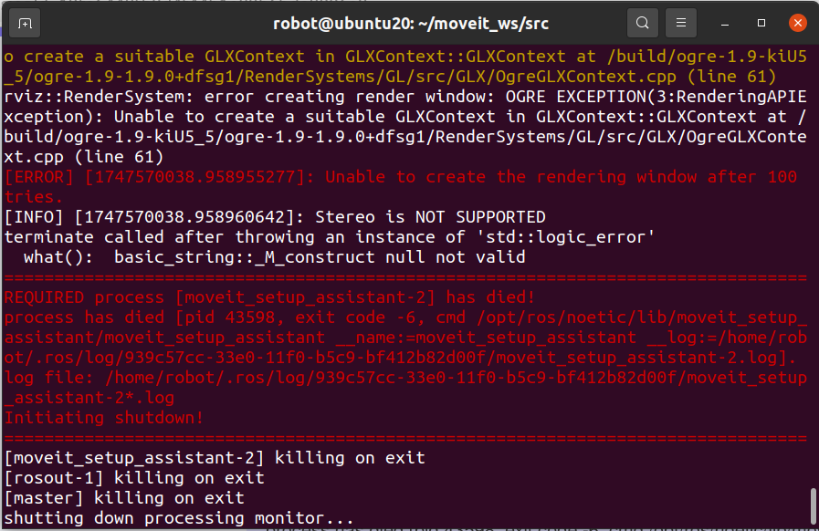

## 机器人学导论实验：iwwa7机械臂的控制
参考内容：
- 张涛：https://github.com/Suixin04/ws_moveit.git
- 张禹豪：https://github.com/Ruochen0513/forABB_IRB_1410
- ROS官方安装教程：https://wiki.ros.org/noetic/Installation/Ubuntu
- MoveIt官方配置教程：https://moveit.github.io/moveit_tutorials/doc/getting_started/getting_started.html
- MoveIt Setup Assistant教程：https://moveit.github.io/moveit_tutorials/doc/setup_assistant/setup_assistant_tutorial.html

## 准备工作
### 系统准备：ubuntu20.04 + ros1 noetic
- ubuntu20.04：
  - 安装：略
  - 更新：
    ```sudo apt update```
    ```sudo apt dist-upgrade```  
- ros1 noetic（鱼香一键安装）：```wget http://fishros.com/install -O fishros && . fishros```
- rosdep：
  ```sudo apt install python3-rosdep python3-rosinstall python3-rosinstall-generator python3-wstool build-essential```
  ```sudo rosdep init```
  ```rosdep update```
### 创建工作空间
- 安装构建工具：```sudo apt install ros-noetic-catkin python3-catkin-tools```
- 创建工作空间moveit_ws：
  ```mkdir -p ~/ws/moveit_ws/src```
  ```cd ~/ws/moveit_ws/src```
  ```catkin_init_workspace```
  ```cd ~/ws/moveit_ws```
  ```catkin_make```
- 添加环境变量：
  ```echo "source ~/ws/moveit_ws/devel/setup.bash" >> ~/.bashrc```
  ```source ~/.bashrc```
### 安装Movelt
  ```sudo apt install ros-noetic-moveit```
  ```sudo apt install ros-noetic-moveit-ros-visualization ros-noetic-moveit-planners ros-noetic-moveit-ros-move-group ros-noetic-moveit-ros-perception```
### 安装RViz和Gazebo
- ```sudo apt install ros-noetic-rviz```
- ```sudo apt install ros-noetic-gazebo-ros-pkgs ros-noetic-gazebo-ros-control```
- ```sudo apt install ros-noetic-rviz-visual-tools```
- ```sudo apt install ros-noetic-gazebo-plugins```
### 安装机器臂（iiwa7）包 
- 下载urdf文件：
  ```cd ~/ws/moveit_ws/src```
  ```git clone https://github.com/facebookresearch/differentiable-robot-model.git```
  ```sudo apt install ros-noetic-franka-description```
- 配置differentiable-robot-model为ros包：添加package.xml和CMakeLists.txt，详细代码略。
- 导出机械臂包：```roslaunch moveit_setup_assistant setup_assistant.launch```
  导出时出现以下错误：OGRE图形渲染引擎和ROS MoveIt Setup Assistant启动失败
  
  - 安装mesa工具```sudo ubuntu-drivers autoinstall```
  - 修改urdf文件（位于/home/robot/moveit_ws/src/differentiable-robot-model/diff_robot_data/kuka_iiwa/urdf/iiwa7.urdf）：为<mesh filename="meshes/iiwa7/x/x"/>在meshes前添加"package://differentiable-robot-model/diff_robot_data/kuka_iiwa/"
  - 建议直接复制urdf文件，后续还有修改。
- MoveIt Setup Assistant：
  - 导入Create New Movelt Configuration Package -> 选择上述urdf文件 -> Browse
  - 自碰撞矩阵：Self-Collisions -> Generate Collision Matrix
  - 虚拟基座关节：Virtual Joints -> Add Virtual Joint -> Virtual Joint Name:virtual_joint -> Parent Frame Name:world
  - 规划组：Planning Groups -> Add Group -> (放大页面到完全显示) -> Group Name:manipulator -> Kinematic Solver:kdl_kinematics_plugin/KDLKinematicsPlugin -> Add Joints:iiwa_joint_1---iiwa_joint_7,左端>右端
  - 原姿态：Robot Poses -> Add Pose -> Pose Name:home -> Planning Group:manipulator -> 默认初始零值
  - 末端执行器：End Effectors -> Add End Effector -> End Effector Name:end_effector -> End Effector Group:manipulator -> Parent Link:iiwa_link_7
  - 作者信息填写：Author Information -> 略
  - 生成配置文件：Configuration Files -> 路径/名称 -> Generate Package
- 编译测试：
  ```cd ~/ws/moveit_ws```
  ```catkin_make```
  ```roslaunch iiwa7_moveit_config demo.launch```（需要点确定）

## iiwa7
### RViz控制
- 创建控制包
  ```cd ~/ws/moveit_ws/src```
  ```catkin_create_pkg iiwa7_control moveit_ros_planning_interface roscpp rospy std_msgs geometry_msgs```
  ```cd iiwa7_control```
  ```mkdir -p scripts```
- 点位控制：五角星+避障
  - 控制代码：
    - ```touch scripts/point_control.py```
    - ```chmod +x scripts/point_control.py```
    - 代码解析见源码。
  - 运行：
    - ```roslaunch iiwa7_moveit_config demo.launch```
    - 去除原始机械臂：左上Displays -> MotionPlanning -> Planning Request -> Query Goal State取消
    - 可视化轨迹：左中Add -> Maker -> OK -> 左中Maker -> Maker Topic下拉选取话题
    - ```rosrun iiwa7_control point_control.py```
- 轨迹控制：字符（字母/数字）内外轮廓
  - 获取轨迹代码：
    - ```touch scripts/letter.py```
    - 代码解析见源码。
  - 控制代码：
    - ```touch scripts/trajectory_control.py```
    - ```chmod +x scripts/trajectory_control.py```
    - 代码解析见源码。
  - 运行：
    - ```roslaunch iiwa7_moveit_config demo.launch```
    - ```rosrun iiwa7_control trajectory_control.py```
### Gazebo控制
- 控制器配置文件：iiwa7_moveit_config/config/controllers.yaml，详细代码略。
  - iiwa_arm_controller/gains：作用于上层控制器。影响跟踪输入的目标轨迹、平滑过渡和跟踪误差响应。
  - gazebo_ros_control/pid_gains：作用于Gazebo插件。直接模拟硬件底层伺服控制器行为，决定仿真环境中的物理表现（刚度、阻尼、扰动抵抗能力，响应速度和稳定性）。
- Gazebo启动文件：iiwa7_moveit_config/launch/iiwa7_gazebo.launch，详细代码略。
- 修改：
  - 确保信息交互（使movelt和gazebo的信息在同一空间下）：修改iiwa7_moveit_config/launch/ros_control_moveit_controller_manager.launch.xml文件，详细代码略。
  - 修改urdf文件：
    - 固定基坐标系：末尾添加部分。
    - 替换过时语法：全部<hardwareInterface>PositionJointInterface</hardwareInterface>-><hardwareInterface>hardware_interface/PositionJointInterface</hardwareInterface>
- 重新编译：
  - ```cd ~/ws/moveit_ws```
  - ```rm -rf build/ devel/```
  - ```catkin build```
- 启动
  - ```roslaunch iiwa7_moveit_config iiwa7_gazebo.launch```（一次运行后关闭界面新建终端后才能重新运行）
  - ```roslaunch iiwa7_moveit_config demo.launch moveit_controller_manager:=ros_control```
  - ```rosrun iiwa7_control point_control.py```（gazebo中没有显式避障）
  - ```rosrun iiwa7_control trajectory_control.py```